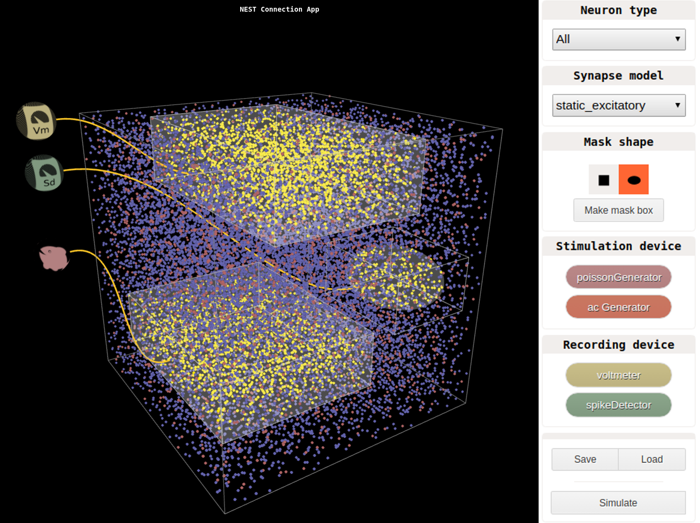

# NEST Connection App

The NESTConnectionApp is a graphical user interface to connect recording and stimulation devices to networks in [NEST](http://www.nest-simulator.org).

<p align="center">
  
</p>

The app client is implemented in JavaScript, with the libraries [three.js](https://threejs.org/) and [React](https://facebook.github.io/react/). The server uses a [Flask](http://flask.pocoo.org/) microframework with NEST in a separate process. The interaction between the server and NEST is done with [ØMQ](http://zeromq.org/), using a Python module called nett.

## Dependencies

You need NEST built with Python support, and importable from Python. To run simulations directly from the app, you need the NEST developer version with tag [`External/TopologySelectNodes`](https://github.com/nest/nest-simulator/tree/External/TopologySelectNodes) or later.

The communication between the Flask server and NEST is done with the included nett module. However, using the nett module requires some paths to be added to ```PYTHONPATH``` and ```LD_LIBRARY_PATH```. To easily add these, run

```
source ./nett_modules/exports.sh
```

You also need a JavaScript package manager installed, like [Yarn](https://yarnpkg.com) or [npm](https://www.npmjs.com/). For brevity we will use Yarn in the examples, but if you're using npm, simply replace ```yarn``` with ```npm``` below. To run the JavaScript tests, you will also need [Node.js](https://nodejs.org/en/), and for testing the Python backend, you'll need [nose](http://nose.readthedocs.io/en/latest/). For generating documentation on the Python backend, you will need [Sphinx](http://www.sphinx-doc.org/en/stable/index.html).

Once you have a package manager for JavaScript, installing the dependencies for running the app is done by simply running

```
$ yarn
```

## Running the App

First start the server with

```
$ yarn start
```

Then open your web browser and go to `http://127.0.0.1:5000/NESTConnectionApp`.


## Running the testsuite

To run the full testsuite, run

```
$ yarn test_all
```

You can also run only the JavaScript testsuite with

```
$ yarn test
```

or just the Python testsuite with

```
$ nosetests
```

## Generating the documentation

To generate the documentation, run

```
$ yarn doc
```

Documentation on the JavaScript part can then be found in `documentation/javascript/index.html`, while documentation on the Python backend can be found in `documentation/python/build/html/index.html`.
